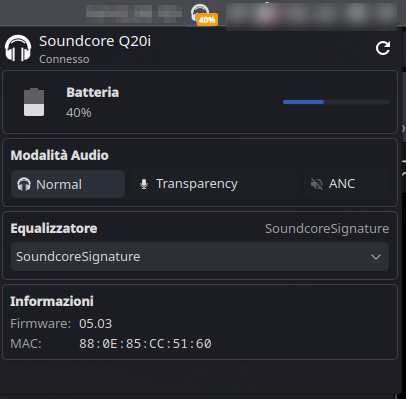
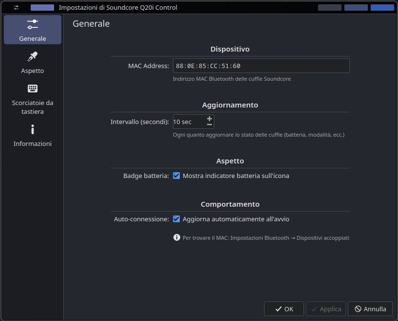
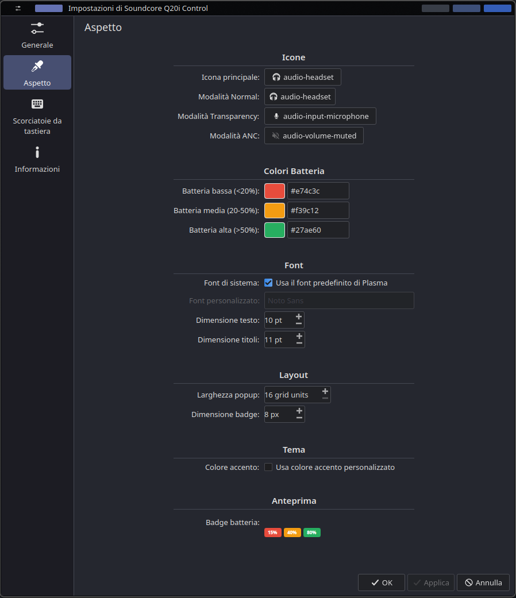

# Soundcore Plasma Widget

<p align="center">
  
  
  
</p>

<p align="center">
  <b>A KDE Plasma 6 widget to control Soundcore headphones and earbuds</b>
</p>

<p align="center">
  
</p>

---

## ✨ Features

- 🔋 **Battery Monitoring** — Real-time battery level with charging indicator
- 🎧 **Sound Modes** — Switch between Normal, Transparency, and Active Noise Canceling (ANC)
- 🎵 **Equalizer Presets** — 22 built-in EQ profiles (Bass Booster, Jazz, Rock, Classical, and more)
- 📊 **System Tray Integration** — Compact icon with optional battery badge
- ⚙️ **Highly Customizable** — Icons, colors, fonts, and layout options
- 🔄 **Auto-refresh** — Configurable polling interval
- 🎯 **Multi-device Support** — Works with 20+ Soundcore models

## 🎧 Supported Devices

| Model | Name |
|-------|------|
| A3004 | Soundcore Q20i |
| A3027 | Soundcore Life Q35 |
| A3028 | Soundcore Life Q30 |
| A3029 | Soundcore Life Tune |
| A3030 | Soundcore Life Tune Pro |
| A3031 | Soundcore Vortex |
| A3033 | Soundcore Life 2 Neo |
| A3040 | Soundcore Space Q45 |
| A3116 | Soundcore Motion+ |
| A3926 | Soundcore Life Dot 2S |
| A3930 | Soundcore Liberty 2 Pro |
| A3931 | Soundcore Life Dot 2 NC |
| A3933 | Soundcore Life Note 3 |
| A3935 | Soundcore Life A2 NC |
| A3936 | Soundcore Space A40 |
| A3939 | Soundcore Life P3 |
| A3945 | Soundcore Life Note 3S |
| A3947 | Soundcore Liberty 4 NC |
| A3948 | Soundcore A20i |
| A3951 | Soundcore Liberty Air 2 Pro |
| A3959 | Soundcore R50i NC |

## 📋 Requirements

- **KDE Plasma 6.0+**
- **openscq30** CLI tool (included in this repository)
- Soundcore headphones/earbuds paired via Bluetooth

### Installing openscq30 CLI

The CLI is bundled in the `OpenSCQ30/` directory, sourced from the original **[OpenSCQ30](https://github.com/Oppzippy/OpenSCQ30)** project by [@Oppzippy](https://github.com/Oppzippy).

To build and install:

```bash
# Install dependencies (Fedora)
sudo dnf install dbus-devel

# Install dependencies (Debian/Ubuntu)
sudo apt install pkg-config libdbus-1-dev

# Install dependencies (Arch)
sudo pacman -S dbus

# Build and install the CLI
cd OpenSCQ30
cargo build --release
cp target/release/openscq30 ~/.local/bin/
```

Alternatively, install from external sources:

```bash
# Arch Linux (AUR)
yay -S openscq30-cli

# From crates.io
cargo install openscq30_cli
```

## 📥 Installation

### From KDE Store (Recommended)

1. Right-click on your panel → **Add Widgets**
2. Click **Get New Widgets** → **Download New Plasma Widgets**
3. Search for "**Soundcore Q20i Control**"
4. Click **Install**

### Manual Installation

```bash
# Clone the repository
git clone https://github.com/YOUR_USERNAME/soundcore-plasma-widget.git
cd soundcore-plasma-widget

# Install from pre-built .plasmoid package
plasmapkg2 -i widget/com.github.soundcore.widget.plasmoid

# Or install from source
cd widget
plasmapkg2 -i .
```

### Upgrade

```bash
plasmapkg2 -u widget/com.github.soundcore.widget.plasmoid
```

### Uninstall

```bash
plasmapkg2 -r com.github.soundcore.widget
```

## ⚙️ Configuration

After adding the widget to your panel, right-click on it and select **Configure**.

### General Settings

| Option | Description |
|--------|-------------|
| **MAC Address** | Bluetooth MAC address of your Soundcore headphones |
| **Refresh Interval** | How often to poll headphone status (5-300 seconds) |
| **Battery Badge** | Show battery percentage on the tray icon |
| **Auto-connect** | Automatically fetch status on startup |

<p align="center">
  
</p>

### Appearance Settings

| Option | Description |
|--------|-------------|
| **Icons** | Customize icons for each sound mode |
| **Battery Colors** | Set colors for low/medium/high battery levels |
| **Font** | Use system font or choose a custom one |
| **Layout** | Adjust popup width and badge size |
| **Theme** | Optional custom accent color |

<p align="center">
  
</p>

### Finding Your MAC Address

1. Open **System Settings** → **Bluetooth**
2. Find your paired Soundcore Q20i
3. Copy the MAC address (format: `XX:XX:XX:XX:XX:XX`)

## 🎨 Equalizer Presets

The widget supports all 22 built-in equalizer profiles:

| | | | |
|---|---|---|---|
| Soundcore Signature | Acoustic | Bass Booster | Bass Reducer |
| Classical | Podcast | Dance | Deep |
| Electronic | Flat | Hip-Hop | Jazz |
| Latin | Lounge | Piano | Pop |
| R&B | Rock | Small Speakers | Spoken Word |
| Treble Booster | Treble Reducer | | |

## 🔧 Troubleshooting

### Widget shows "Disconnected"

1. Ensure your headphones are powered on
2. Verify Bluetooth connection in system settings
3. Check that `openscq30` CLI is installed and working:
   ```bash
   openscq30 device list
   ```
4. Verify the MAC address in widget settings

### Commands not working

Test the CLI directly:
```bash
openscq30 device --mac-address 'XX:XX:XX:XX:XX:XX' setting -j -g batteryLevel
```

### Battery level shows incorrect percentage

The Q20i reports battery in 6 levels (0-5). The widget converts these to percentages:
- 0 → 0%, 1 → 20%, 2 → 40%, 3 → 60%, 4 → 80%, 5 → 100%

## 🌍 Translations

The widget supports multiple languages:

| Language | Status |
|----------|--------|
| 🇬🇧 English | ✅ Complete |
| 🇮🇹 Italian | ✅ Complete |

**Want to help translate?** See [TODO.md](TODO.md) for instructions on adding new translations.

## 🤝 Contributing

Contributions are welcome! Feel free to:

- 🌍 Add translations
- 🐛 Report bugs
- 💡 Suggest features
- 🔧 Submit pull requests

## 📄 License

This project is licensed under the **GPL-3.0 License** — see the [LICENSE](LICENSE) file for details.

## 🙏 Credits

- **[OpenSCQ30](https://github.com/Oppzippy/OpenSCQ30)** — The amazing CLI tool that makes this widget possible
- **KDE Community** — For the Plasma desktop and development tools

---

<p align="center">
  Made with ❤️ for the KDE community
</p>

